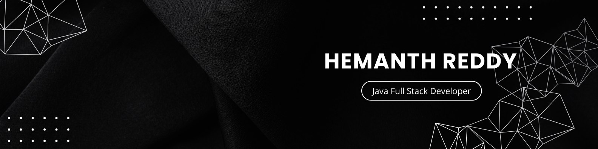

<h1 align="left">👋 Hi, I'm hemanth reddy </a></h1>
<h3 align="center">  </h3>

- 👨‍💻 Aspiring Java Full-Stack Developer & Web Developer based in India.
- 📫 How to reach me: [hemanthgreat100@gmail.com](hemanthgreat100@gmail.com)
- 📱 Built projects like **learn-shphere** and **Webcam Security Tool** to solve real-world problems!
- ⭐ Check out my featured projects:  and Security Tool, earning recognition from peers!
- 🔗 Growing my professional network on LinkedIn, let's collaborate!
- 🚀 Passionate about AI, Cybersecurity, and Web Development—constantly building, learning, and evolving!

  
<h3 align="left">📲 Connect with me:</h3>

  
  

<h3 align="left">🚀 Tech Stack:</h3>

 

 
 

 

  

<h3 align="left">🗄️ Databases:</h3>

  
  
  
  

 

<h3 align="left">🔒 Security Tools:</h3>

  
  
  

 

<h3 align="left">📊 GitHub Activity:</h3>
<table>
  <tr>
    <td></td>
    <td></td>
  </tr>
</table>

  

<picture>
  <source media="(prefers-color-scheme: dark)" srcset="https://raw.githubusercontent.com/tobiasmeyhoefer/tobiasmeyhoefer/output/github-snake-dark.svg" />
  <source media="(prefers-color-scheme: light)" srcset="https://raw.githubusercontent.com/tobiasmeyhoefer/tobiasmeyhoefer/output/github-snake.svg" />
  
</picture>

